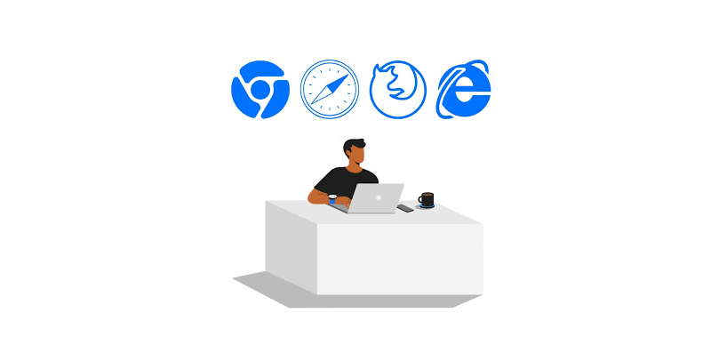

# Welcome to the Cross-Browser Development Tips

👋 Welcome to the official repository of the Cross-Browser Development Tips! We're thrilled to introduce you to our powerful and versatile software plugin, meticulously crafted by our talented team of software engineers. Whether you're a developer, designer, or an enthusiast, this plugin aims to enhance your experience by bringing a new dimension to your workflow.

## What is the Cross-Browser Development Tips?

If you are developing a web application that targets various browsers, it is important to ensure that this application works properly across different browsers.  Here are some important steps you should consider for cross-browser development:

## Key Features

- 🚀 **Using Normalize or Reset CSS 1:** You can use tools such as normalize.css or reset.css to balance the default style differences of browsers.
- ⚙️ **Use Modern Web Technologies 2:** You can increase browser compatibility by using up-to-date web technologies.  For example, prefer technologies such as ES6+ JavaScript usage, CSS Grid, Flexbox.
- 📦 **Use Vendor Prefixes 3:** Use CSS3 features with vendor prefixes to ensure browser compatibility (such as -webkit-, -moz-, -ms-, -o-).
- 📊 **Using Polyfill or Shim 4:** If the browser does not support it, fill in the gaps using polyfills or shims.  For example, you can use Babel in browsers that do not support ES6+ features.
- ⚙️ **Use Feature Detection 5:** Check browser features using feature detection in JavaScript, such as if (window.localStorage)).

## Getting Started

Getting started with the XYZ Plugin is a breeze:

1. **Determining Browser Support:** First, determine the browsers you are targeting and the support levels on those browsers.  Perform compatibility tests, especially for popular browsers (such as Chrome, Firefox, Safari, Edge).
2. **Browser Compatibility Tests:** Test on different browsers to ensure browser compatibility.  For this, you can use browser emulators, testing on real devices or cloud-based services..
3. **Use Debugging Tools:** Debug using the developer tools provided by browsers (Chrome Developer Tools, Firefox Developer Tools, etc.)..
4. **Improve CSS and JavaScript Performance:** Increase performance by writing efficient code.  For example, avoid DOM manipulations and overly repetitive CSS selectors.

## Installation

Avoid DOM manipulations and overly repetitive CSS selectors. 
Consider Accessibility: make your website accessible to all users by using aria tags, correct title structures, and other accessibility techniques.  
`<li><a href="#" aria-label="Hakkında">Hakkında</a></li>` 
Use Semantic Elements: Structure your document using correct HTML5 semantics.  For example, <header> for the title, <main> for the content, <nav> for the side menus.

## Documentation

Keep documentation of the project.  This is important for future development or sharing with your team.

## Feedback and Support

Responsive and Flexible Design: Having a responsive design of your web page ensures that it works properly on different screen sizes and devices.

## Contributing

Be Careful of HTTP and HTTPS Problems: Browsers can sometimes block insecure content (HTTP).  Therefore, use HTTPS if possible.

## Stay Connected

Browsers and technologies are constantly changing.

We're excited to have you on board and can't wait to see how the XYZ Plugin transforms your creative and development endeavors. Happy coding!

*— Can Ata Web Developer*
